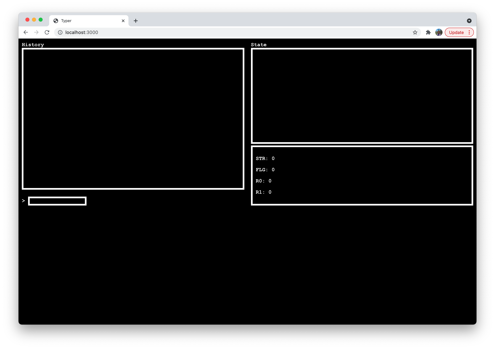

# Typer

_A fantasy computer written using TypeScript._

Typer has a command history window (top-left), a 32x32 pixel graphics display (top-right), an input region (bottom-left), and an overview of the state (bottom-right).

Typer currently has a store register (`STR`), a flag bit (`FLG`), and two general-purpose registers (`R0`, `R1`).

A small set of commands can be used to interact with Typer.

To start the development version of Typer, run `yarn`, then `yarn dev`. Typer will be accessible at [localhost:3000](localhost:3000).

## Commands 👨‍💻

| Name        | Syntax        | Example   |
| ----------- | ------------- | --------- |
| `MOV`       | `MOV s,d`     | `MOV 1,R0` (Move 1 to the `R0` register) |
| `ADD`       | `ADD s,d`     | `ADD 1,STR` (Add 1 to the `STR` register, placing the output in `STR`) |
| `SUB`       | `SUB s,d`     | `SUB 3,R0` (Subtract 3 from the `R0` register, placing the output in `R0`) |
| `MUL`       | `MUL s,d`     | `MUL 2,R1` (Multiply the value of `R1` by 2, placing the output in `R1`) |
| `DIV`       | `DIV s,d`     | `DIV 3,STR` (Divide the value of `STR` by 3, placing the output in `STR`) |
| `FLG`       | `FLG x`       | `FLG 1` (Set the value of `FLG` to 1) |
| `INC`       | `INC abc`     | `INC R0` (Increment the value of `R0`) |
| `POKE`      | `POKE x,y`    | `POKE 1,1` (Turn the pixel at the X-value `1` and the Y-value`1` off) |
| `PLCE`      | `PLCE x,y`    | `PLCE STR,1` (Turn the pixel at the X-value of `STR` and Y-value `1` on) |

Build with ❤️ using [Vite.js](https://vitejs.dev/)